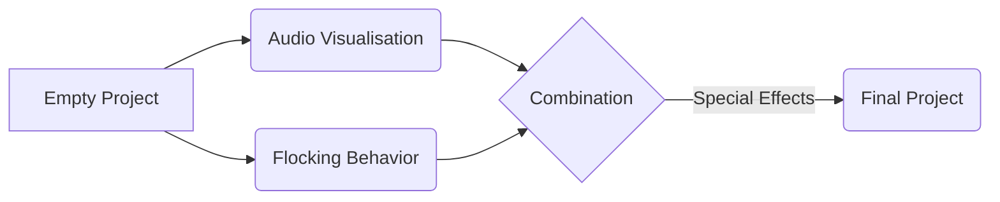

# Musical-Flocking
## Display
#### Works On Flocking And Audio Visualization with FFTWindow.Blackman Spectrum Bands.
Here is the example Scene:
[]
## RoadMap

### 3 Simple Rules of Flocking Behavior:  
- **Alignment**:  Causes a particular agent to line up with agents close by.
- **Cohesion**:  Causes agents to steer towards the "center of mass" - that is, the 	   average position of the agents within a certain radius.
- **Separation**:  Causes an agent to steer away from all of its neighbors.
